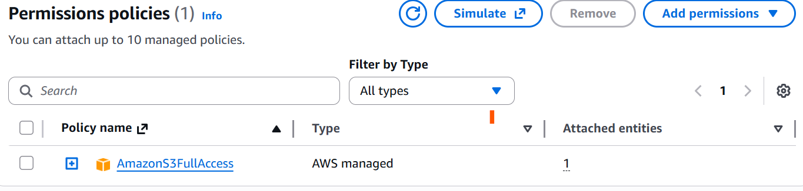
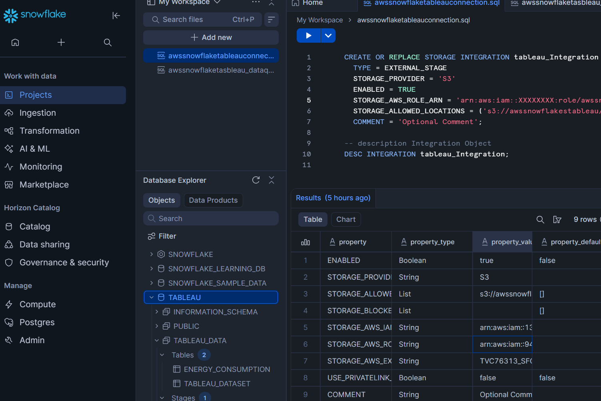
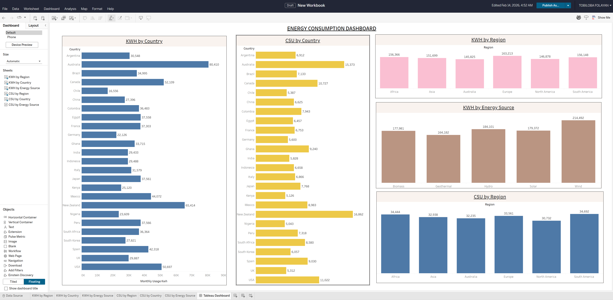

# 🚀 Energy Analytics Pipeline

### Amazon Web Services (S3) → Snowflake → Tableau

---

## 📌 Project Overview

This project demonstrates how to build an end-to-end modern data platform.

The pipeline:

1. Stores raw energy data in AWS S3
2. Establishes secure cross-account authentication using IAM role assumption
3. Loads data into Snowflake
4. Applies SQL-driven business transformations
5. Exposes curated datasets to Tableau
6. Produces an executive analytics dashboard

This mirrors real production patterns used by data engineering and analytics teams.

---

## 🧱 Architecture

```
S3 Bucket
   ↓
Storage Integration
   ↓
External Stage
   ↓
Raw Table
   ↓
Analytics Table
   ↓
Tableau Dashboard
```

---

## 🎯 Skills Demonstrated

- Cloud storage design
- IAM roles & trust policies
- Secure service authentication
- External staging
- Bulk ingestion with COPY INTO
- SQL transformation & modeling
- BI connectivity
- Business rule implementation

---

## ⚙️ Prerequisites

To reproduce this project, you will need:

- AWS account
- Snowflake account
- Tableau Desktop or Tableau Public
- Energy dataset in CSV format

---

---

# 🪣 Part 1 — AWS Setup

---

## Step 1 — Create S3 Bucket

Navigate to **S3 → Create bucket**.

Example name:

```
awssnowflakestableau
```

Recommended:

- Keep **Block Public Access = ON**
- Choose a region close to your Snowflake account

---

## Step 2 — Upload Dataset

Upload your CSV file, for example:

```
energy_data.csv
```

Now your path becomes:

```
s3://awssnowflakestableau/energy_data.csv
```

---

## Step 3 — Create IAM Policy



Create a policy granting Snowflake permission to read from the bucket.

Required actions:

- `s3:GetObject`
- `s3:GetObjectVersion`
- `s3:ListBucket`

Restrict resources to your bucket and its contents.

Example name:

```
SnowflakeS3ReadPolicy
```

---

## Step 4 — Create IAM Role

Create a role Snowflake will assume.

Trusted entity → **AWS Account** (temporary placeholder).

Attach:

```
SnowflakeS3ReadPolicy
```

Role name:

```
awssnowflakestableaurole
```

Save the **Role ARN** — it will be used in Snowflake.

---

---

# ❄️ Part 2 — Snowflake Setup

---

## Step 5 — Create Storage Integration

This creates the secure bridge between Snowflake and S3.

```sql
CREATE OR REPLACE STORAGE INTEGRATION tableau_Integration
TYPE = EXTERNAL_STAGE
STORAGE_PROVIDER = 'S3'
ENABLED = TRUE
STORAGE_AWS_ROLE_ARN = 'arn:aws:iam::xxxxxxxx:role/awssnowflakestableaurole'
STORAGE_ALLOWED_LOCATIONS = ('s3://awssnowflakestableau/');
```

## 

## Step 6 — Retrieve Trust Values

```sql
DESC INTEGRATION tableau_Integration;
```

Copy:

- `STORAGE_AWS_IAM_USER_ARN`
- `STORAGE_AWS_EXTERNAL_ID`

---

## Step 7 — Update AWS Trust Relationship

Return to AWS → IAM → Roles → open `awssnowflakestableaurole`.

Replace the trust policy using the Snowflake values.

After saving:

✅ AWS trusts Snowflake  
✅ Snowflake can assume the role  
✅ Secure connectivity is enabled

---

---

## Step 8 — Create Database & Schema

```sql
CREATE DATABASE tableau;
CREATE SCHEMA tableau_Data;
```

---

## Step 9 — Create Raw Ingestion Table

```sql
CREATE TABLE tableau_dataset (
    Household_ID STRING,
    Region STRING,
    Country STRING,
    Energy_Source STRING,
    Monthly_Usage_kWh FLOAT,
    Year INT,
    Household_Size INT,
    Income_Level STRING,
    Urban_Rural STRING,
    Adoption_Year INT,
    Subsidy_Received STRING,
    Cost_Savings_USD FLOAT
);
```

---

## Step 10 — Create External Stage

```sql
CREATE STAGE tableau.tableau_Data.tableau_stage
URL = 's3://awssnowflakestableau/'
STORAGE_INTEGRATION = tableau_Integration;
```

---

### Validate access

```sql
LIST @tableau.tableau_Data.tableau_stage;
```

If files appear → integration successful 🎉

---

---

## Step 11 — Load Data

```sql
COPY INTO tableau_dataset
FROM @tableau.tableau_Data.tableau_stage
FILE_FORMAT = (TYPE = CSV FIELD_DELIMITER = ',' SKIP_HEADER = 1)
ON_ERROR = 'CONTINUE';
```

---

### Verify

```sql
SELECT * FROM tableau_dataset;
```

Raw cloud data is now inside Snowflake.

---

---

## Step 12 — Create Analytics Table

Best practice: never modify raw data.

```sql
CREATE TABLE energy_consumption AS
SELECT * FROM tableau_dataset;
```

---

---

## Step 13 — Apply Business Transformations

We simulate policy adjustments based on income level.

---

### Adjust Monthly Usage

- Low → +10%
- Middle → +20%
- High → +30%

```sql
UPDATE energy_consumption
SET monthly_usage_kwh = monthly_usage_kwh * 1.1
WHERE income_level = 'Low';

UPDATE energy_consumption
SET monthly_usage_kwh = monthly_usage_kwh * 1.2
WHERE income_level = 'Middle';

UPDATE energy_consumption
SET monthly_usage_kwh = monthly_usage_kwh * 1.3
WHERE income_level = 'High';
```

---

### Adjust Cost Savings

- Low → −10%
- Middle → −20%
- High → −30%

```sql
UPDATE energy_consumption
SET cost_savings_usd = cost_savings_usd * 0.9
WHERE income_level = 'Low';

UPDATE energy_consumption
SET cost_savings_usd = cost_savings_usd * 0.8
WHERE income_level = 'Middle';

UPDATE energy_consumption
SET cost_savings_usd = cost_savings_usd * 0.7
WHERE income_level = 'High';
```

---

The dataset is now analytics-ready.

---

---

# 📊 Part 3 — Tableau Setup

---

## Step 14 — Connect to Snowflake

Open Tableau → choose **Snowflake**.

Enter:

- Account
- Warehouse
- Database = `tableau`
- Schema = `tableau_Data`

Select:

```
energy_consumption
```

Connection established.

---

## Step 15 — Build Dashboard



Example visualizations:

- KWH by Country
- CSU by Country
- KWH by Region
- KWH by Energy Source
- CSU by Region

Common measures:

```
SUM(Monthly_Usage_kWh)
SUM(Cost_Savings_USD)
```

Combine sheets into an executive dashboard.

---

---

## 🏆 Outcome

Built a secure, cloud-native analytics system featuring:

✔ Cross-platform authentication  
✔ Automated ingestion  
✔ Data transformation  
✔ Warehouse modeling  
✔ BI consumption

This is production-style data engineering.

---

## 🚀 Possible Enhancements

Future improvements could include:

- Snowpipe for auto-ingestion
- dbt for transformation management
- Airflow orchestration
- Data quality checks
- CI/CD deployment
- Role-based access control
- Cost optimization strategies

---

## 👤 Author

**Tobiloba Folayan**  
Data & Cloud Engineering Enthusiast
